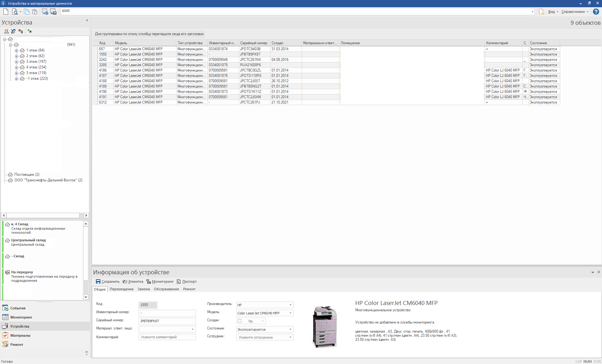
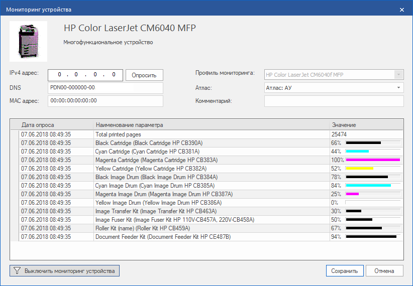
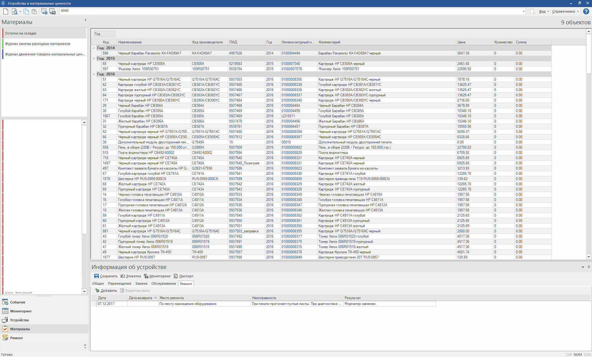
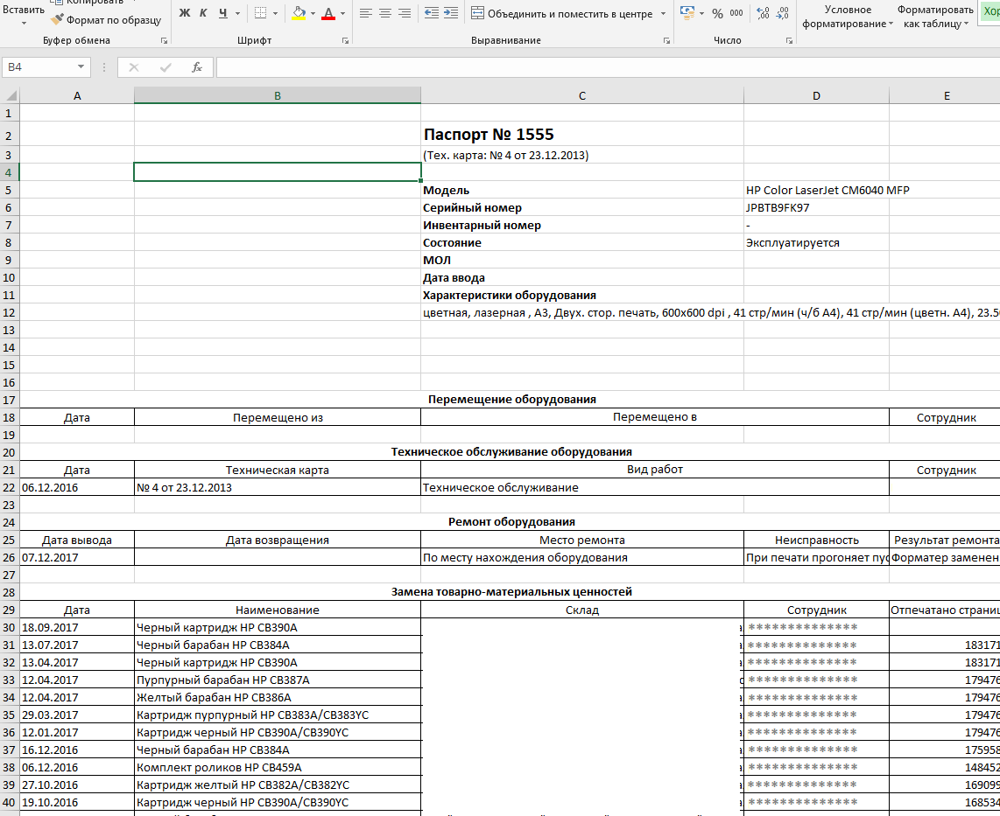
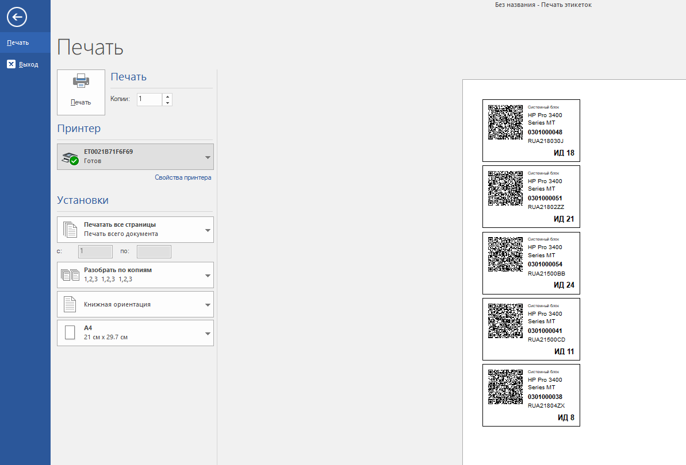

# CI_NI_Base

## DB scheme MSQLServer ci init version 
Схема базы данных учета вычислительной техники и расходных материалов.\
Реализована в СУБД MS SQL Server.

### Логика реализована средствами СУБД:
- Управвление помещениями
- Управление устройствами
- Отображение текущего состояния устройства
- Отображение перемещений устройств (как единичного, так и в составе группы)
- Реализована иерапхическая схема связей устройств (Родительскому подчинены дочерние, как единый объект)
- Поиск дубликатов
- Формирование отчетов
- и многое другое.

### Используются сущности БД:
- Таблицы
- Представления
- Хранимые процедуры
- Определяемые пользователем функции
- Табличные переменные и обобщенные представления (в том числе рекурсивные)
- Тригеры
- Связанные серверы
 
## DB scheme MySql ni init version
Схема базы данных мониторинга оборудования.\
Реализована в СУБД MySql.

### Логика реализована средствами СУБД:
- Управвление шаблонами мониторинга
- Управление устройствами
- Управление атласами оборудования
- Планирование проверки
- Формирование отчетов
- и многое другое

### Используются сущности БД:
- Таблицы
- Представления
- Хранимые процедуры
- Определяемые пользователем функции 
- Тригеры
- События

Представленные схемы содержат определения перврначальной версии работа над которой была начата в 2016 году.\
Для полноценного использования требует доработки.

## Пример использования БД
\

\

\

\

\

 